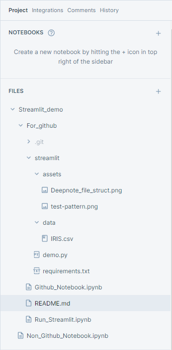

# Example connecting to Streamlit cloud from Deepnote through Github


## Description

This will use a single, shared ```requirements.txt``` file. It will be shared between Deepnote, through the init file, and Streamlit, 
which requires ```requirements.txt``` to load libraries it needs.
This repo was made to show was how to reference a file in both Deepnote ans Streamlit, as well as a convenient file structure to use in Deepnote.

### Deepnote file structure




For file referenceing, this line of code was key

```
Path(__file__).parents[1]
```

It lives online here: https://legolego-streamlit-demo-streamlitdemo-un56xj.streamlitapp.com/
## Getting Started

### Dependencies

* Deepnote project
* Streamlit account
* Github account

### Installing

* Just clone this or copy/paste :)
* This text can be pasted into a new Deepnote file with **.ipynb** extension:
```{
 "cells": [
  {
   "cell_type": "markdown",
   "metadata": {},
   "source": [
    "import os"
   ]
  }
 ],
 "nbformat": 4,
 "nbformat_minor": 5,
 "metadata": {}
}
```
Once created, click to a different file, then back to this one, and it should(as of 10/18/2022) be recognized as a jupyter notebook.
More information from Deepnote is here: https://deepnote.com/docs/notebooks

### Executing program

* https://legolego-streamlit-demo-streamlitdemo-un56xj.streamlitapp.com/
* in your directory analogous to and located at the same level as ```/For_github``` run the following commands from the terminal:
```
git init
git add *
git commit -m "initial commit"
git branch -M main
git remote add origin https://github.com/YOURGITHUBACCOUNT/Streamlit_demo.git
```

## Help

Any advise for common problems or issues.


## Authors

Oleg


## Acknowledgments

* [simple-readme](https://gist.github.com/DomPizzie/7a5ff55ffa9081f2de27c315f5018afc)
